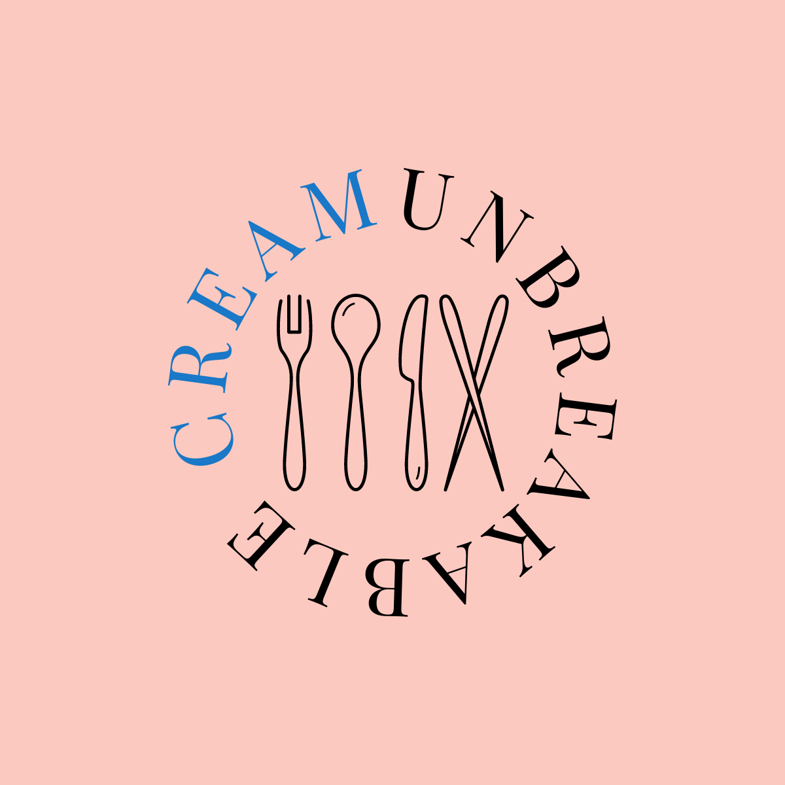

<a name="readme-top"></a>

<br />
<div align="center">
  <a href="https://github.com/topcowmoo/unbreakable-cream">
    
  </a>

<h3 align="center">Unbreakable Cream</h3>

<p align="center">
  
A social recipe platform enabling users to discover, post and comment on, recipes shared by a vibrant community of home cooks and culinary enthusiasts.

<br />
    <a href="https://github.com/topcowmoo/unbreakable-cream"><strong>Explore the docs</strong></a>
    <br />
    <br />
    <a href="https://unbreakable-cream-798945248a5e.herokuapp.com/">Deployed app on Heroku</a>
    · 
    <a href="https://github.com/topcowmoo/unbreakable-cream/issues">Report Bug</a>
    ·
    <a href="https://github.com/topcowmoo/unbreakable-cream/issues">Request Feature</a>

  </p>
</div>

<!-- TABLE OF CONTENTS -->

<details>
  <summary>Table of Contents</summary>
  <ol>
    <li>
      <a href="#about-the-project">About The Project</a>
      <ul>
        <li><a href="#built-with">Built With</a></li>
      </ul>
    </li>
        <li><a href="#installation">Installation</a></li>
      </ul>
    </li>
    <li><a href="#contributing">Contributing</a></li>
    <li><a href="#contact">Contact</a></li>
    <li><a href="#acknowledgments">Acknowledgments</a></li>
  </ol>
</details>

<!-- ABOUT THE PROJECT -->

## About The Project

A full-stack CMS-style web application employing the Model-View-Controller (MVC) architecture, built with Node.js and Express.js. It utilizes Handlebars for dynamic templating, MySQL for persistent data storage, and Sequelize ORM for efficient database management. Deployed on Heroku, this application offers an interactive and refined user experience.

Landing Page:


Login Page:


Dashboard Page:


<!-- BUILT WITH -->

## Built With


<!-- INSTALLATION -->

### Installation

1. Clone the repo
   ```sh
   git clone https://github.com/topcowmoo/unbreakable-cream
   ```
2. Install NPM packages
   ````sh
   npm install   ```
   ````
3. Create and source the schema from the terminal
   ````sh
   CREATE DATABASE unbreakable_db;
   source ./db/schema.sql   ```
   ````
4. Seed the database from the terminal
   ````sh
   npm run seed ```
   ````
5. Start the server from the terminal
   ````sh
   npm start ```
   ````

<p align="right">(<a href="#readme-top">back to top</a>)</p>

<!-- CONTRIBUTING -->

## Contributing

Contributions are what make the open source community such an amazing place to learn, inspire, and create. Any contributions you make are **greatly appreciated**.

If you have a suggestion that would make this better, please fork the repo and create a pull request. You can also simply open an issue with the tag "enhancement".
Don't forget to give the project a star! Thanks again!

1. Fork the Project
2. Create your Feature Branch (`git checkout -b feature/AmazingFeature`)
3. Commit your Changes (`git commit -m 'Add some AmazingFeature'`)
4. Push to the Branch (`git push origin feature/AmazingFeature`)
5. Open a Pull Request

<p align="right">(<a href="#readme-top">back to top</a>)</p>

<!-- CONTACT -->

## Contact

- Sahil Banati - [@github](https://github.com/sbanati) - smbanati@gmail.com
- Jianing Zhou - [@github](https://github.com/Joyce77777777) - ccata9328@gmail.com
- Saran Anthony - [@github](https://github.com/anthosaran)
- Brock Lockhart-Doyle - [@github](https://github.com/blockdoyle) - blockdoyle@gmail.com
- Salvatore Mammoliti - [@github](https://github.com/topcowmoo) - mammoliti.sam@gmail.com


Deployed Link: [https://unbreakable-cream-798945248a5e.herokuapp.com/](https://unbreakable-cream-798945248a5e.herokuapp.com/)

Project Link: [https://github.com/topcowmoo/unbreakable-cream](https://github.com/topcowmoo/unbreakable-cream)

<p align="right">(<a href="#readme-top">back to top</a>)</p>

<!-- ACKNOWLEDGMENTS -->

## Acknowledgments

- Daler Singh - Project Manager - [@linkedin](https://www.linkedin.com/in/daler7/?originalSubdomain=ca)
- Sachin Jhaveri - Project Manager - [@linkedin](https://www.linkedin.com/in/sachin-jhaveri-42436280/?originalSubdomain=ca)
- Sahil Banati - [@github](https://github.com/sbanati) 
- Brock Lockhart-Doyle - [@github](https://github.com/blockdoyle)
- Jianing Zhou - [@github](https://github.com/Joyce77777777)
- Saran Anthony - [@github](https://github.com/anthosaran)
- Team Lead - Salvatore Mammoliti - [@github](https://github.com/topcowmoo)
- ChatGPT - [@OpenAI Chat](https://chat.openai.com/)
- Markdown Badges - [@Markdown Badges](https://ileriayo.github.io/markdown-badges/#usage)
- Adobe Fonts - [@Adobe Fonts](https://new.express.adobe.com/)
- Font Awesome - [@Font Awesome](https://fontawesome.com/)

<p align="right">(<a href="#readme-top">back to top</a>)</p>

---


